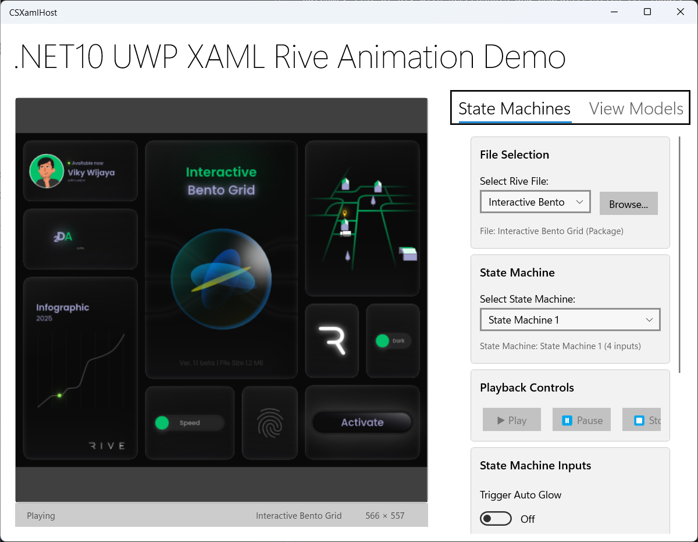

# Overview
This page tracks the list of experiments and prototypes that will inform the project and track progress in the prototyping phase.  Overall status as of September 2025:

1. Basic Windows library functional with Win32 (C++), UWP (C++ `CoreWindow`, C# XAML)
2. DirectX11 Backend
3. `Windows.UI.Composition` with `Swapchain` hosting
4. Win32 and UWP input support (`User32`, `CoreWindow`)
5. WinRT Component wrapper with partial API
6. CSWinRT projection for Component into managed projects.  Support for dotnet 9 and dotnet 10
7. Debug and Release mode nuget packages
8. Debug and Release build support  

Rive capabilities supported:
- Rendering and mouse input
- Window resizing
- Support for loading .riv files
- StateMachine enumeration 
- StateMachine control (stop, play, set inputs)
- Partial support for Rive ViewModels (string properties only); create instances and properties, update properties

# Experiments

### 0.1 Build Rive Windows DX11 backend
Outcome: documentation for building DX11 backend and running Rive samples in the [rive-renderer](https://github.com/rive-app/rive-runtime/tree/main/renderer) project.

Status: DONE ✅

### 0.2 Test path_fiddle with a couple of RIV files
Outcome: list of RIV with screenshots and characteristics (eg input, binding etc) [Fix markdown as part of this].

Status: DONE ✅

---

# Prototypes

### 0.1 Standalone Windows win32 Project
#### Outcomes:
- standalone project added to this repo that can render Rive content in a Win32 window
- Loading / device initialization / Rendering with animation / windows resizing / no input, all hard coded

#### Status: DONE ✅
---
### 0.2 WinRive component refactor
#### Outcomes:
- WinRive core lib project
- Win32 Test project rewired to lib
- Add win32 test buttons to play, pause, stop, load different scenes

#### Status: DONE ✅
---
### 0.3 UWP host project
#### Outcomes: 
- WinRive WinRT componet DLL wrapping WinRive lib
- Windows UWP test app launches and renders content using CoreWindow and WinRive component
    - Loading / device initialization / Rendering with animation / windows resizing / no input

#### Status: DONE ✅
---
### 0.4 Create WinRT WinRT Component
#### Outcomes:
- a WinRT Component that consuming the WinRive lib
- API surface to control Rive functionalty
    - Load file
    - Start stop rendering
    - Enumerate StateMachines
    - Play StateMachines
    - Set inputs on statemachines
- New host applications that leverage WinRT Control
    - Win32
    - UWP C++ (Core Window)
    - WinUI3 <-- Not functional due to `SwapChain` binding issue.

#### Status: DONE ✅
---
### 0.5 C# Support
#### Outcomes:
- New C# XAML UWP host
- Add C# projection to the WinRive component
- NuGet debug package

#### Status: DONE ✅
---
### 0.6 Microsoft Hackathon 2025
#### Outcomes:
- Add support for ViewModels to WinRive Core
- Add support for ViewModels to WinRT API
- C# XAML control wrapper local to C# XAML UWP host
    - Refactor UI for StateMachine control
    - New UI to enumerate and set ViewModels, ViewModelInstances, ViewModel properties
- Fix hit testing in WinRiveCore
- Fix release mode build of component
- Release mode NuGet package

#### Status: DONE ✅
---
### 0.7 PostHackathon cleanup
#### Outcomes:
- Update GitHub readme.md with high level status and video
- Cleanup XAML control wrapper (strip garbage, simplify)
- Fix statemachine input issue
- Fix ViewModel WinRT mapping (not hardcoded)
- Plan to add all remaining ViewModel types in WinRiveCore
- Fix Statemachine controls
- pinpoint and rix random timing-related crashes
---

# Future Prototype Work

## DirectX12

## CompositionSwapchain
Outcome:  Trianlge rendered using CompositionSwapchain
Plan:
- Naive approach
- Optimize non animating case to delete backbuffers
- Optimize resize to use progressive buffer sizing

## Island Source
Outcome: C++ island content source that can render a square into a swapchain using D2D, input, focus, transform all work, hosted in WinUI3 host
Plan:
- Build island
- Host in all supported island host frameworks

## 5. Island-based hosting in more host types
- Win32
- WinUI3
- React Native
- what else?

## Spectrum Analizer usage of Rive for rendering 
## Port WinRT component to .NET 10

# references
1. Rive Windows DX11 backend: https://github.com/rive-app/rive-runtime/blob/main/renderer/src/d3d11/render_context_d3d_impl.cpp
2. Rive Windows DX12 backend: [https://github.com/rive-app/rive-runtime/blob/main/renderer/src/d3d11/render_context_d3d_impl.cpp](https://github.com/rive-app/rive-runtime/blob/main/renderer/src/d3d12/render_context_d3d12_impl.cpp)
3. Rive Windows sample: https://github.com/rive-app/rive-runtime/blob/main/renderer/path_fiddle/fiddle_context_d3d.cpp
4. CompositionSwapchain: https://learn.microsoft.com/en-us/windows/win32/comp_swapchain/comp-swapchain
5. Windows UI Islands: how to consume: https://github.com/microsoft/WindowsAppSDK-Samples/tree/main/Samples/Islands
